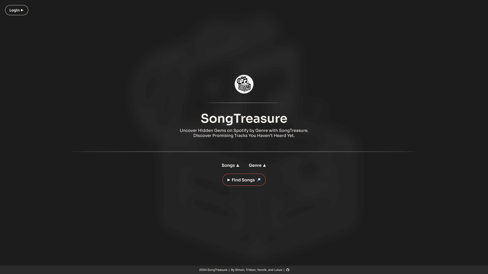

```
   _____                _______                                
  / ____|              |__   __|                               
 | (___   ___  _ __   __ _| |_ __ ___  __ _ ___ _   _ _ __ ___ 
  \___ \ / _ \| '_ \ / _` | | '__/ _ \/ _` / __| | | | '__/ _ \
  ____) | (_) | | | | (_| | | | |  __/ (_| \__ \ |_| | | |  __/
 |_____/ \___/|_| |_|\__, |_|_|  \___|\__,_|___/\__,_|_|  \___|
                      __/ |                                    
                     |___/                                    
```


## Video Demonstration:
<a href="https://youtu.be/8V1NvSnASxg" target="_blank">
    
</a>

## User Story:
"As a music enthusiast, I often find myself bored and uninspired by the repetitive nature of Spotify's playlists, which fail to introduce me to new and exciting tracks. Despite the platform's promises, I am stuck in a bubble of familiar sounds, preventing me from exploring the vast diversity of musical genres. Seeking a solution, I discovered SongTreasure, a revolutionary web application designed to reignite my passion for musical discovery. With Song Treasure's advanced machine learning algorithms, I can select my preferred genre and desired number of new songs, and the app will fetch the newest and most novel tracks from Spotify's global library. Each track is accompanied by a unique Treasure Score, predicting its potential popularity and adding excitement to my musical exploration. The 30-second preview feature allows me to taste each track before adding it to my library. With seamless integration to my Spotify account, I can effortlessly add discovered songs to my playlists with a single click. SongTreasure transforms my listening experience, breaking me free from the monotony of repetitive playlists and reigniting the thrill of discovering new music that resonates with me."

## Key Features of SongTreasure:
- **1. Advanced Genre-Based Discovery:** Select your preferred genre and the desired number of new songs, and SongTreasure will fetch the latest and most novel tracks recently added to Spotify's global library.

- **2. Treasure Score:** Each track comes with a unique Treasure Score, a metric that predicts its potential popularity, helping you gauge the potential of each song and adding excitement to your musical exploration.

- **3. 30-Second Previews:** Listen to a 30-second preview of each track to get a taste before committing it to your library, ensuring you only add songs that truly resonate with you.

- **4. Seamless Spotify Integration:** Log into SongTreasure with your Spotify credentials and directly add discovered songs to your personal playlists with a single click, simplifying your music management.

- **5. Personalized Exploration:** Break free from the monotony of repetitive playlists with a tool designed to introduce you to hidden gems and diverse genres, enhancing your overall musical journey.

## How to install SongTreasure:
- **1.** Install `python` (we used Python 3.9.(13) for this project)
- **2.** Optional: install a `Code-Editor` like Visual Studio Code
- **3.** `Download` this `repository` (main branch), (e.g. click green "<> Code" button on GitHub, download ZIP and unpack)
- **4.** Install `dependencies`: Open a terminal in the ...\SongTreasure main folder, and run:
```
pip install -r requirements.txt
```
- **5.** `Locate the env.txt` file and `follow its inctructions`, the files name afterwards must be solely `.env`, read next points to understand what
to paste exactly into this file
- **6.** Create an `Spotify "App"`:
   - SongTreasure connects to your Spotify account and uses the `Spotify API` (you must have Spotify `Premium!`)
   - Go to: https://developer.spotify.com/dashboard and `create a new App` (click "Create App")
   - Paste http://localhost:8080/callback into the `Redirect URIs` field, enter your desired name and description
   - Go to the created Apps' `Settings`, here you will find the `Client ID` and `Client secret` (click "view client secret")
   - `Paste` both values `to the .env file` at the `respective places`
- **7.** The setup should be complete, the main `entry point of SongTreasure` is the file `App.py`, which you can either `run with your Code-Editor/IDE`, use your `Terminal`, or via `clicking App.py directly`
   - It will show a terminal with some information, you should see the following:
   ```
   .
   .
   WARNING: This is a development server. Do not use it in a production deployment. Use a production WSGI server instead.
   * Running on all addresses (0.0.0.0)
   * Running on http://127.0.0.1:8080 (*1)
   * Running on http://192.168.2.100:8080 (*2)
   Press CTRL+C to quit
   .
   .
   ```
   - The adresses `(*1, *2)` might be different for you
   - To open SongTreasure `paste one of those IP-Adresses into your browser`:
   - *1 is the Loopback IP-Adress, it also resolves to http://localhost:8080/, with it you can access SongTreasure only from the computer you ran it from
   - *2 is the private IP-Adress of the device you ran it from, you can ALSO paste this IP into other devices' browser in your network and will see SongTreasure
   - Feel free to set a browser bookmark to access SongTreasure via the IP's quicker, however *2 might change depending on your router settings
   - You can `stop SongTreasure with CTRL+C in your terminal`. You have to redo step 7, if you want to run SongTreasure again
- **8.** If you have `any troubles` with installing and running, `feel free to reach out to us`